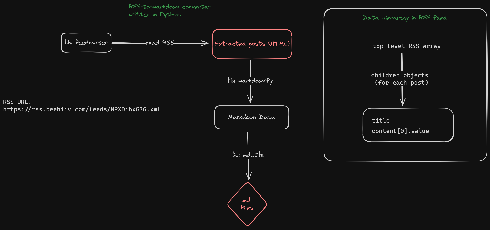

## Why?

I used to write and publish on [Beehiiv](https://beehiiv.com), a newsletter platform for writers. Now, I decided to start writing on my own personal website and I'd like to have all my previously published posts available on my own website.

Unfortunately, Beehiiv doesn't allow for markdown exports of published posts. As a coder, I took it as a challenge to figure out how to export my Beehiiv posts to markdown files so I can easily publish them on my new website.

## What is this?

I wrote a Python script that processes Beehiiv's RSS feed and generates simple markdown files with the published content.

### Strategy

This is the development strategy of the program which eventually became script.py in this repository.

